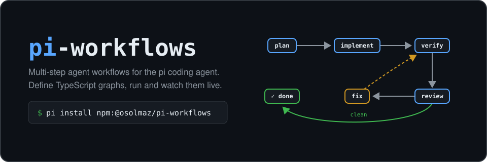

# pi-workflows

<p align="center">
  
</p>

pi-workflows is a workflow extension for the [pi coding agent](https://pi.dev).
It lets you define multi-step agent workflows as TypeScript graphs, trigger
them at any point in a pi conversation with `/workflow`, and watch them run
live in a standalone terminal viewer.

The workflow model is a port of [openclaw/acpx](https://github.com/openclaw/acpx)
flows into pi itself. Agent steps run inside your current pi conversation, so
the model keeps everything it already knows from the discussion. The model
completes each step by calling a JSON `workflow` tool, which gives the engine
structured, validated output to route on. See the
[design philosophy](docs/DESIGN_PHILOSOPHY.md) for the principles behind the
engine and its public parts. Running steps can publish durable [workflow
updates](docs/WORKFLOW_UPDATES.md), including progress counts and ETA data.
Agent instructions use compact [workflow step
messages](docs/WORKFLOW_STEP_MESSAGES.md), and the built-in
[monitor](docs/MONITOR.md) reports every check without starting an extra
assistant turn.

## Install

```bash
pi install npm:@osolmaz/pi-workflows
```

You can also install directly from GitHub:

```bash
pi install git:github.com/osolmaz/pi-workflows
```

Or try the npm package without installing it:

```bash
pi -e npm:@osolmaz/pi-workflows
```

The Pi package includes the extension and five optional skills:

- `pi-workflows` teaches the agent how to operate and author workflows.
- `monitor` starts and operates the built-in monitor workflow.
- `autoplan` selects the best practical solution and writes an implementation plan.
- `autodoc` records an existing plan in canonical documentation.
- `autoimplement` implements an existing plan and verifies the result.

Pi discovers these skills when it loads the package. Use `pi config` to disable
the extension, all bundled skills, or one skill independently. The equivalent
settings entry below keeps the extension and disables only `monitor`:

```json
{
  "packages": [
    {
      "source": "npm:@osolmaz/pi-workflows",
      "skills": ["-skills/monitor"]
    }
  ]
}
```

Set `"skills": []` to disable all bundled skills while keeping the extension.
Set `"extensions": []` to keep the skills without loading the extension.

Install the interactive terminal viewer separately from crates.io. The crate
is named `pi-workflows`; its command is `piw`:

```bash
cargo install pi-workflows
piw
```

The npm package also includes the simpler `pi-workflows` snapshot viewer. To
link that command from a clone, run `npm install && npm run build && npm link`,
or run it in place with `npx tsx src/viewer/cli.ts`.

## Herdr integration

pi-workflows also ships as a [Herdr](https://herdr.dev) plugin. After installing
`piw` and pi-workflows, synchronize the bundled plugin:

```bash
pi-workflows herdr sync
```

Run the same command after a pi-workflows update. It finds the package that
provides the running CLI and repairs a Herdr link when npm moved that package.
`pi-workflows herdr setup` remains an alias for existing installations. Use
`--json` for versioned machine-readable output. The [Herdr plugin sync
plan](docs/plans/2026-08-20-herdr-plugin-sync-plan.md) defines update and
recovery behavior.

When Pi runs inside Herdr, a workflow widget shows `Ctrl+Shift+R piw`. When the widget has hidden rows, this call to action shares the existing scroll-controls line instead of taking another line.
The shortcut opens the exact run bundle and lets you choose a split, tab, or new
workspace. `/piw` opens the same menu, and `/piw right`, `/piw below`, `/piw
left`, `/piw above`, `/piw tab`, or `/piw workspace` selects a placement
directly. If a viewer for that run already exists, pi-workflows focuses it
instead of opening a duplicate.

The plugin uses Herdr's public pane APIs and runs no service or polling loop. It
is also available through the [Herdr plugin marketplace](https://herdr.dev/plugins/).

## Quick start

Put a workflow file in `.pi/workflows/` (project) or `~/.pi/agent/workflows/`
(global):

```typescript
// .pi/workflows/echo.workflow.ts
import { agent, defineWorkflow } from "@osolmaz/pi-workflows";

export default defineWorkflow({
  name: "echo",
  presentationPrompt: "Give the user the concise reply from the workflow result.",
  startAt: "reply",
  nodes: {
    reply: agent({
      prompt: ({ input }) => `Answer concisely: ${(input as { task?: string }).task}`,
      expectedOutput: `{ "reply": "your concise answer" }`,
    }),
  },
  edges: [],
});
```

Then, from any pi conversation:

```
/workflow echo summarize this repository
```

A model-started workflow is saved before the tool reports it as queued. The returned run ID works
with `workflow status` and `workflow cancel` before execution starts. pi-workflows waits for the
current agent turn to settle before activation. If activation fails, it saves the failure and sends
one follow-up turn so the model can correct the cause and start a new run.

`/workflow` with no arguments lists discovered workflows. `/workflow pause`
lets the current step finish and then holds the run before the next node. This
is useful when you want to interject in the conversation mid-workflow.
`/workflow resume` continues it. Pressing escape to interrupt a turn
pauses the workflow automatically, so the run never nudges the model while
you have taken the conversation back; `/workflow resume` re-delivers the
pending step prompt. `/workflow cancel` stops the active run; if the last run
already ended (for example parked at a checkpoint), it clears the leftover
widget instead. Trailing text becomes `{ task: "..." }`; pass arbitrary input
with `--input-json {"key": "value"}`. The names `answer`, `cancel`, `list`, `pause`, `resume`, and `status` are
reserved and rejected as workflow names.

While a run is on screen, the footer status bar shows a compact
`wf <name> [status] <node>` indicator alongside the widget.

`presentationPrompt` is optional. When present, pi-workflows uses it after the
structured run ends to request one normal, human-readable assistant response.
Workflows without it remain silent after their final structured output, which
keeps shell-only and machine-consumed workflows model-free.

## Compose workflows

A workflow can import another workflow and connect its named exits without copying its nodes:

```typescript
import { compute, defineWorkflow, includeWorkflow } from "@osolmaz/pi-workflows";
import autoplan from "./autoplan.workflow.js";

export default defineWorkflow({
  source: import.meta.url,
  name: "parent",
  startAt: "start",
  includes: {
    design: includeWorkflow(autoplan, {
      input: ({ outputs }) => ({ problem: String(outputs.start) }),
    }),
  },
  nodes: {
    start: compute({ run: () => "Fix the reported defect" }),
    finish: compute({ run: ({ outputs }) => outputs.design }),
  },
  edges: [
    { from: "start", to: "design" },
    { from: "design.ready", to: "finish" },
    { from: "design.blocked", to: "finish" },
  ],
});
```

Direct imports check child input and exit names in TypeScript. Names and paths remain available for dynamic discovery. Nested children share one run, trace, pause state, and cancellation state. See [Workflow composition](docs/WORKFLOW_COMPOSITION.md) for the complete contract.

## Agent-managed workflows

The model can use the same `workflow` tool to list, start, inspect, pause,
resume, cancel, and answer workflows. Step contracts use the tool's `submit`
action. Slash commands and model actions share one lifecycle implementation.

pi-workflows includes a `monitor` workflow for plain-language requests such as:

> Monitor PR 123 every 30 minutes. Report failed checks. Stop when it is merged or closed.

The monitor checks immediately, reports only the states requested by the user,
waits with a normal shell action, and loops until its stop condition or check
limit. Its input supports `task`, `everyMinutes`, `stopWhen`, `maxChecks`, and
an optional `checkTimeoutMinutes`.

Monitor is observation-only by default. An explicit `repair` policy authorizes its composed `autoplan` and `autoimplement` path. The monitor checks the target again after repair and stops when the same issue and target evidence return without progress. Project and global workflows can replace the built-in `monitor` by using the same file name.

A monitor occupies the session's one active workflow slot. If its Pi runner
stops during the shell wait, the run parks and repeats that wait node when a
runner resumes it.

Because the workflow runs in your current conversation, you can have a long
discussion first and then trigger a workflow that builds on it. The
`autoplan` example does exactly that. It frames the problem and scope, devises
an elegant production-ready solution, and compares it with the holy grail. It
then selects the best practical in-scope solution without asking the user to
resolve the gap. The ideal can win when it is feasible, but work outside the
current authority cannot block a valid practical solution. The workflow ends
with a detailed implementation plan. `autoplan` replaces the earlier
`autodevise` name; the old command and export are not retained.

## Watching a run

Runs persist to `~/.pi/agent/workflows/runs/` as they execute. The viewer
tails that directory and re-renders on every state change:

```bash
pi-workflows view          # interactive picker, live updates
pi-workflows view <runId>  # jump straight to one run
pi-workflows runs          # plain list of recent runs
pi-workflows view --once   # print a snapshot and exit (good for scripts)
```

The run detail view draws the workflow as a boxed graph, like the acpx replay
viewer. Included nodes use hierarchical labels such as `implementation › redesign › plan`. Every card has a centered step-name header and a divider above its
structured metadata. Border characters keep the graph background, the body
surface begins inside the border, and the header interior uses a separate
surface. Node type, status, attempts, and timing use compact symbol rows; start
and terminal markers sit outside the card. Node types have distinct
semantic colors, active cards use a heavy border, branches carry their case
labels, the taken path is highlighted, and loops route through a gutter on the
right back into their target from above. `←/→` scrubs
backwards and forwards through the recorded steps and re-derives every node's
status as of that step, with the selected step's full output shown below;
scrubbing to the end snaps back to following the run live.

The Rust `piw` viewer under `tui/` adds a Catppuccin interface, selectable
themes, centered active-node following, draggable browser and inspector sizes,
detailed trace and conversation inspection, temporal replay, and reconnecting
remote viewing. Full cards have one fixed graph-wide size, so streaming,
selection, timer ticks, and replay never move nodes or edges. Live conversation
capture shows text, thinking, tool calls, and tool execution as they happen,
then reconciles settled messages to verbatim Pi entries. See
[the piw guide](docs/tui-viewer.md).

```
  ┏━━━━━━━━━━━━━━━━━━━━━━━━━━━━━━┓
  ┃            review            ┃
  ┣━━━━━━━━━━━━━━━━━━━━━━━━━━━━━━┫
  ┃ ● agent            ◐ running ┃
  ┃ ↻ 2                    ◷ 12s ┃
  ┃ ◇ clean                     ┃
  ┃ ◇ issues_found              ┃
  ┃ … reviewing implementation  ┃
  ┗━━━━━━━━━━━━━━━━━━━━━━━━━━━━━━┛
```

Inside pi, a compact widget above the editor shows one line per workflow node.
The first glyph is the node status. The second glyph is the node type: `●`
agent, `ƒ` compute, `!` notification, `$` shell action, `*` function action, or
`◆` checkpoint. Repeated visits, runtime details, and timing appear on the same
line when they apply. Pi's current theme highlights the full active-node line,
while status glyphs keep every state readable without color. Long workflows are
windowed around the active node.
Scroll the list with `shift+↑` / `shift+↓`; it snaps back to following the
active node whenever the workflow advances a step. Use `piw` when you need the
full boxed graph and its edges.

## Node types

A workflow is a graph of named nodes with exactly one entry point. Each node
finishes with a JSON output, and edges decide what runs next.

An `agent` node sends a prompt into the pi conversation and waits for the
model to submit its output through the `workflow` tool. A `compute` node runs
a pure TypeScript function. A `notify` node writes a durable message for the
Pi session that started the run. An `action` node performs a side effect,
either a TypeScript function (`action({ run })`) or a runtime-owned shell
command (`shell({ exec, parse })`). A `checkpoint` node ends the run in a
`waiting` state so a human can pick it up. On top of `agent`, the `decision` helper asks
the model to pick from a fixed set of choices and validates the answer, and
`decisionEdge` routes on the result with compile-time case checking.

See [docs/workflows.md](docs/workflows.md) for the full authoring reference
and [docs/run-bundles.md](docs/run-bundles.md) for the on-disk run format.

## Controllers

Controllers keep long-running automation aligned with current external state. They store desired state in `spec`, report observed state through conditions and `status`, and reconcile a deduplicated resource key whenever an event or retry makes it ready.

Put `*.controller.ts` files in `.pi/controllers/` or `~/.pi/agent/controllers/`. Import the API from `@osolmaz/pi-workflows/controllers`:

```typescript
import { conditionTrue, defineController } from "@osolmaz/pi-workflows/controllers";

export default defineController({
  name: "example",
  initialStatus: () => ({ phase: "new" }),
  reconcile: (ctx, resource) =>
    ctx.settled({
      controllerStatus: { phase: "done" },
      conditions: [conditionTrue("Ready", "Complete")],
    }),
});
```

Apply and inspect resources from Pi:

```text
/controller apply example item-1 {"enabled":true}
/controller get example item-1
/controller reconcile example item-1
```

The standalone CLI provides read-only views with `pi-workflows controllers` and `pi-workflows controller <controller> <key>`. See [docs/CONTROLLERS.md](docs/CONTROLLERS.md) for reconciliation, queue, effect, and child workflow semantics.

## Always-on workflows

Runs do not depend on the Pi window. Every `/workflow` run is claimed through a durable queue, so closing Pi mid-run **parks** the run instead of cancelling it. Another interactive session cannot claim it. Reopening the exact session that started the run resumes it. A standalone host can also resume it without changing where reports go. A checkpointed run waits durably until you answer it with `/workflow answer <json>`, which continues the graph in a linked run.

Workflow reports use a durable session-addressed outbox. A report waits while its starting session is closed and is delivered only to that session when it opens again. Runs in the same directory do not broadcast messages to each other's conversations.

For runs that must continue while Pi is closed, keep the standalone host running:

```bash
pi-workflows host --project /path/to/project
```

The host claims parked runs and reconciles controllers without a Pi session. Conversation nodes execute in headless `pi --mode rpc` children that expose the same `workflow` tool contract. It is a foreground process — stop it with Ctrl-C; a crashed host's leftovers are reaped by the next one. See [docs/workflows.md](docs/workflows.md#durable-runs-parking-and-resume) for the model and [docs/run-bundles.md](docs/run-bundles.md) for the on-disk rules.

## Examples

The [examples/workflows/](examples/workflows/) directory mirrors the acpx
example set. Copy any of them into `.pi/workflows/` to use them:

- `echo` is the smallest possible workflow, one agent step.
- `branch` classifies a task with a `decision` and routes to either a
  continue lane or a clarification checkpoint.
- `shell` runs a runtime-owned shell command and parses its output, with no
  agent step at all. Shell and function actions can publish durable progress
  while they run.
- `two-turn` chains three agent steps that build on each other's outputs in
  the same conversation.
- `autoplan` turns the current problem into a chosen practical solution and
  a detailed implementation plan, using the ideal end state as guidance rather
  than an out-of-scope requirement.
- `autoimplement` finds a clear existing plan, documents it when needed,
  implements and verifies it, writes and runs the exact Pi Reviewer command,
  tracks P0 through P2, handles PR comments and CI, and
  finalizes the PR. P0 and P1 fixes require another review. P2-only work is
  verified without another reviewer round. A five-minute CI wait routes to
  additional useful local testing. New evidence can route through autoplan
  and autodoc before implementation resumes.
- `human-decision` shows a reusable verified-human gate with a structured
  machine subject, a separate readable operator presentation, plain choices,
  and exact replan text.
- `approved-plan` composes autoplan, autodoc, and the reusable plan-approval
  workflow without copying their internal nodes.
- `autoresearch` runs an iterative feature-search loop in the style of
  [karpathy/autoresearch](https://github.com/karpathy/autoresearch): setup
  creates a frozen evaluation harness, one editable feature file, and a
  journal; each loop iteration runs one generation of experiments and
  journals every result; an assess decision keeps looping until a kept
  result plateaus or a diverse generation all fails, then conclusions are
  written before the winner is promoted out of the loop directory.

The controller example at `examples/controllers/pull-request.controller.ts`
shows child repair work and check polling. It also uses expected-head guards
and recoverable merge effects.

## License

[MIT](LICENSE)
