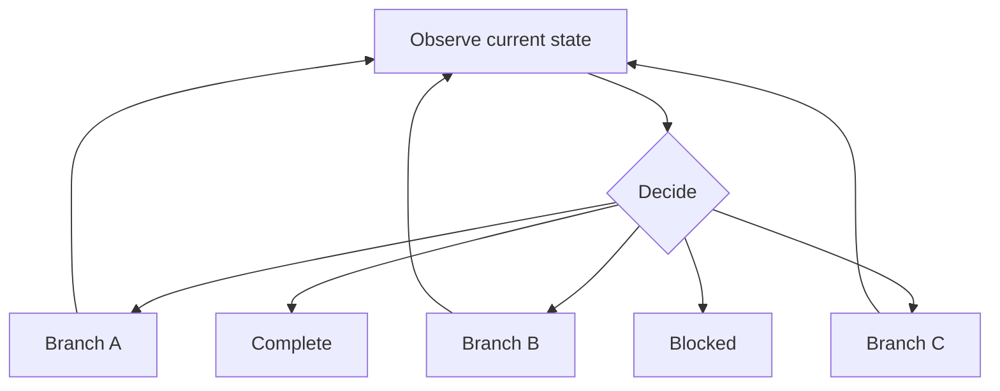
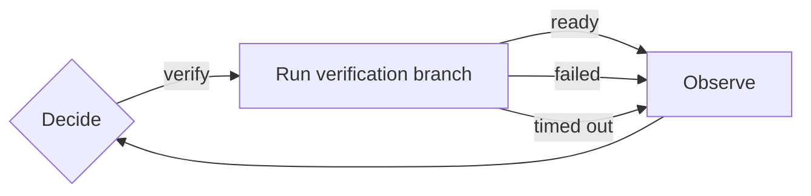
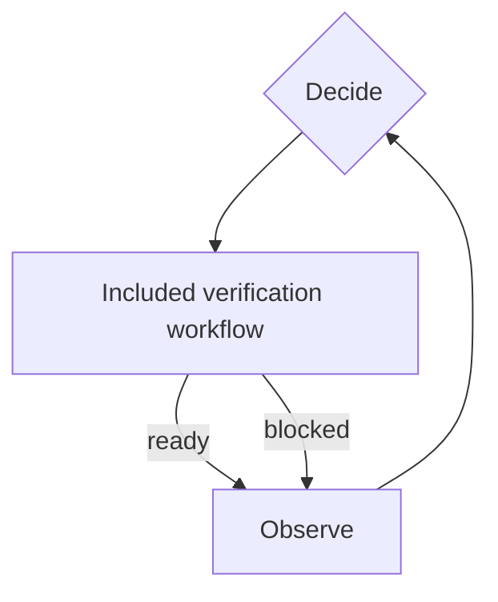
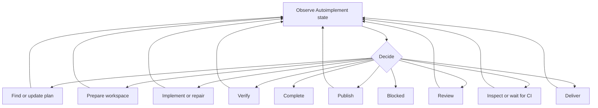
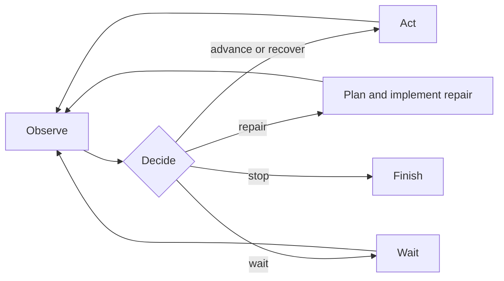

# Control loops

Status: current

A control loop lets a workflow choose its next branch from current state. Each branch returns control after one limited unit of work. The controller then observes the new state and chooses again.

Use this structure when work may need to move forward, return to an earlier stage, wait, repair a failure, or stop. A fixed sequence remains better when every successful run follows the same order.

## Terms

A **control loop** repeatedly observes state and decides what action to take until the goal is complete or progress is blocked.

A **controller** owns the decision policy. It does not perform the selected work.

A **decision node** returns one allowed route as structured data.

A **branch** is the node or included workflow selected by a route. It performs one limited unit of work and returns control.

A **return point** is the accepted node result or named child exit that sends control back to observation.

A **terminal route** ends the loop as completed or blocked.

## Basic flow



The workflow author chooses the branches. The control-loop helper connects the decision and return edges. The expanded workflow still contains ordinary Pi Workflows nodes and edges.

## Current building blocks

Pi Workflows already provides the runtime parts needed for a control loop:

- `agent()` for decisions that require model judgment;
- `compute()` for observation summaries and deterministic guards;
- `action()` and `shell()` for runtime-owned work;
- `includeWorkflow()` for a reusable branch;
- named child exits for branch results;
- `$result.outcome` routing for `ok`, `failed`, `timed_out`, and `cancelled` results;
- `decision()` and `decisionEdge()` for constrained model choices and exhaustive route cases;
- run outputs, results, steps, events, and effect receipts for durable evidence.

A control loop composes these parts. It does not require another runtime node kind.

## Authoring API

The package exports a `controlLoop()` helper. The helper receives a decision source, a return target, and a typed route map.

```typescript
const loop = controlLoop({
  decide: "decide",
  returnTo: "observe",
  routes: {
    implement: {
      to: "implement",
      returns: ["implementationResult"],
    },
    verify: {
      to: "verification",
      returns: ["verification.ready", "verification.blocked"],
    },
    complete: {
      to: "prepareCompleted",
      terminal: true,
    },
    blocked: {
      to: "prepareBlocked",
      terminal: true,
    },
  },
});
```

The helper returns the route names and the ordinary edges needed by the loop.

```typescript
nodes: {
  observe: compute({ run: collectCurrentState }),
  decide: decision({
    choices: loop.choices,
    question: decideFromCurrentState,
  }),
  // Branch nodes remain ordinary workflow nodes.
},
edges: [
  ...loop.edges,
  // Internal branch edges remain explicit here.
],
```

A workflow with a richer decision result can use an ordinary `agent()` node and its own validator. The route validator must use the route names returned by `controlLoop()` as its allowed set.

### Input fields

`decide` names the node whose accepted output contains the selected route.

`returnTo` names the observation or decision entry that receives all nonterminal branch returns. It may equal `decide` when that node performs its own observation.

`routes` maps each allowed route to one target and its return points.

`to` names an ordinary node or an included-workflow mount.

`returns` lists the nodes or named child exits that finish a nonterminal branch. The helper adds an edge from each return point to `returnTo`.

`terminal: true` marks a route that ends the loop. A terminal route has no return points.

### Definition checks

The helper rejects a definition when:

- `decide` or `returnTo` is empty;
- no routes are declared;
- a nonterminal route has no return point;
- a terminal route declares a return point;
- the controller is also listed as a branch return;
- a route or reference violates existing workflow naming rules;
- `cancelled` is declared as a continuation route.

When two routes use the same return point, the helper emits one return edge. Literal route and reference names remain available to TypeScript. The surrounding `defineWorkflow()` call keeps its existing checks for unknown nodes, invalid child exits, duplicate outgoing edges, and unreachable nodes.

## Decision results

A decision must be structured and bounded. The smallest valid result is:

```json
{
  "route": "verify",
  "reason": "The current implementation has no accepted verification result."
}
```

A workflow may require more evidence:

```json
{
  "route": "repair",
  "reason": "The current change caused the failed check.",
  "evidence": ["candidate check failed while the same base check passed"],
  "nextAction": "Fix the implementation and run the same check again."
}
```

The model may choose only a declared route. A validator rejects unknown routes on the same workflow request so the model can correct its output.

The workflow owns route-specific rules. For example, a completed route can require current verification and delivery evidence. A blocked route can require proof that no safe action remains within authority.

## Branch behavior

A branch performs one limited unit of work. It returns facts instead of choosing an unrelated later branch.



Expected operational outcomes are part of the graph:

| Outcome     | Required behavior                                                   |
| ----------- | ------------------------------------------------------------------- |
| `ok`        | Finish the branch and return accepted evidence.                     |
| `failed`    | Record the failure and return control when recovery is safe.        |
| `timed_out` | Record the timeout and return control when active work has settled. |
| `cancelled` | End immediately. Do not return to the controller.                   |

A parser error, invalid graph, unknown route, or failed invariant remains a workflow failure. The controller must not hide programming errors as ordinary branch results.

## Included workflows

An included workflow can serve as a branch through its named exits.



The child owns its expected internal failures and timeouts. Each expected non-cancelled path must reach a named exit. The parent lists those exits as branch return points.

A parent does not catch an arbitrary unhandled child error. This keeps child ownership clear and prevents the controller from hiding a broken child definition.

## Observation

Observation reads current facts. It does not change files, processes, remote resources, authority, or workflow state outside normal accepted outputs and updates.

A compute node can summarize accepted run data before the decision. A model decision may also use allowed read-only tools when repository or remote state must be checked.

Use facts that already exist:

- accepted node outputs and outcomes;
- the current plan and its digest;
- the prepared workspace;
- the current diff, branch, and head revision;
- verification results;
- review and CI fingerprints;
- effect receipts;
- remote pull-request and delivery state;
- the latest failure and previous decisions.

Do not add a controller-specific database or copy the run into another state store.

## Side effects

The controller is read-only. The selected branch owns each effect.

Before retrying a branch that may have changed external state, observation must determine whether the effect completed. An accepted idempotent receipt can be adopted. An uncertain manual effect must not be repeated blindly.

This rule applies to commits, pushes, pull requests, comments, merges, releases, deployments, paid Jobs, and other consequential actions.

A route never grants authority. The branch still checks the user's scope, repository rules, live settings, spending limits, and protected decisions before it acts.

## Completion and blocked results

Completion means that the workflow goal is satisfied now. The workflow must check every required current gate before it accepts the terminal route.

A blocked result means that the goal is incomplete and no authorized safe route remains. The result must name the blocker, the evidence, and the practical alternatives that were checked.

A branch failure alone does not prove that the workflow is blocked. The controller can choose repair, an earlier check, redesign, a wait, or another declared route.

## Progress and limits

Every loop needs a finite safety bound. `maxSteps` remains the final workflow limit.

A workflow also checks useful progress with facts it can observe. Useful facts can include a changed plan digest, diff, head revision, check result, review fingerprint, CI state, effect receipt, or failure state.

When the same route returns with the same relevant facts and no new evidence, the controller must select another safe route or report blocked. It must not consume the remaining step limit by repeating unchanged work. Autoimplement fingerprints stable branch facts and ignores timing fields and temporary request or working-directory values when it applies this check.

The controller has its own named active-time limit. It does not recover recursively through itself. If its normal bounded submission recovery cannot produce a valid decision, the workflow reports a clear blocker.

## Nested loops

An included workflow may have its own control loop. The child controls only its local work and returns through named exits. The parent controls cross-branch decisions.

For example, a verification child can manage a limited repair and recheck loop. The Autoimplement parent can then decide whether the final verification result requires implementation repair, redesign, publication, or a blocked result.

Root and child `maxSteps` limits continue to apply. Re-entering an included workflow starts a fresh invocation with empty local outputs, as defined by workflow composition.

## Autoimplement example

Autoimplement can use these routes:



The controller can return to an earlier route when later evidence shows that more work is needed. A verification planning timeout returns evidence to the controller. It does not require a fresh Autoimplement run.

## Monitor example

Monitor already follows this control loop:



Monitor supplies its own routes and checks. The shared helper supplies only the route and return edges.

## Visualization

The helper expands to normal graph nodes and edges before execution. The existing viewer can draw the loop without a new rendering protocol.

The controller should use the visible node ID `decide`. Observation should use `observe` or another clear local name. Branch node names should describe the work they perform.

Viewer tests must show:

- the decision node once;
- one labeled outgoing edge for each route;
- branch return edges leading to observation;
- terminal completed and blocked routes;
- included workflow groups without exposing private child routing to the parent;
- the active branch and latest accepted controller decision during replay.

A future visual grouping feature may use ordinary graph structure to identify the loop. The authoring helper does not add hidden viewer metadata.

## Compatibility

`controlLoop()` is an additive TypeScript authoring API. It returns existing edge definitions and adds no runtime node type.

Workflow definitions that do not use the helper remain unchanged. Existing saved runs keep their snapshotted graphs. Built-in workflows that adopt the helper raise their revisions and use the new graph only for new runs.

Pi Workflows is in alpha. A built-in conversion replaces the old graph in place. It does not keep fallback routers, aliases, dual paths, or compatibility readers.

## Verification

Tests for the public helper cover:

- route and reference type inference;
- exhaustive route targets;
- nonterminal returns and terminal routes;
- ordinary node and named child-exit returns;
- invalid names and shared return-source deduplication;
- expansion to ordinary edges;
- existing graph validation after expansion;
- nested included workflows;
- failure and timeout returns;
- terminal cancellation;
- no hidden runtime or snapshot fields.

A workflow that adopts the helper also tests every route, every return, completion checks, blocked checks, no-progress behavior, uncertain effects, pause, resume, interruption, and cancellation.

## Related documents

- [Workflow authoring reference](WORKFLOWS.md)
- [Workflow composition](WORKFLOW_COMPOSITION.md)
- [Design philosophy](DESIGN_PHILOSOPHY.md)
- [Add reusable workflow control loops](plans/2026-09-11-reusable-workflow-control-loop-plan.md)
