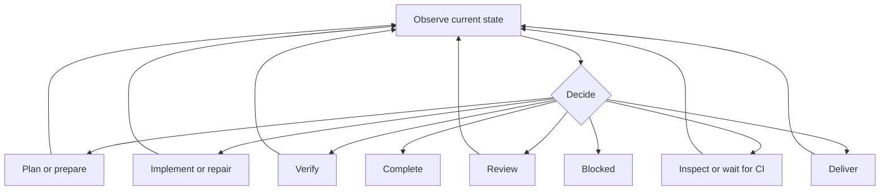

# Add reusable workflow control loops

Workflows need one central decision point that can send work into custom branches and receive control again. Autoimplement needs this structure so a recoverable failure or timeout leads to a new decision in the same run instead of ending the run or starting over.

The standard term for this structure is a control loop. The component that observes state and chooses the next action is the controller. The workflow node that makes the choice is named `decide`.

This plan adds a reusable TypeScript authoring helper and uses it in Autoimplement and Monitor. It uses existing workflow nodes, edges, includes, events, and run state. It does not add a runtime node type, a service, or another state store.

The current workflow behavior is documented in [Workflow authoring reference](../WORKFLOWS.md). The relevant design rules are in [Design philosophy](../DESIGN_PHILOSOPHY.md) and [Workflow composition](../WORKFLOW_COMPOSITION.md). The earlier timeout and blocker work is recorded in [Add Autoimplement timeout fallback](2026-08-21-autoimplement-timeout-fallback-plan.md) and [Confirm blockers before autoimplement stops](2026-08-20-autoimplement-blocker-challenge-plan.md).

## Problem

Autoimplement routes most successful work directly from one stage to the next. It uses separate recovery paths for timeouts and blocker claims. This splits the decision about what to do next across many nodes.

The verification incident showed the gap. The included `localVerification/planChecks` node timed out before the child workflow reached its `ready` or `blocked` exit. The parent therefore had no accepted child result to route. The complete Autoimplement run ended before its timeout fallback could inspect the state.

Restart then created a new child run, but the model-visible result named the terminal parent run. The model inspected the wrong run. Restart is useful for a terminal run, but it is the wrong normal recovery path for a recoverable stage failure.

The same structural need appears in Monitor. Monitor already follows an `observe -> decide -> act -> observe` control loop. The common graph shape should be available to other workflows without copying route and return edges.

## Evidence

The failed Autoimplement run recorded these facts:

- `localVerification/planChecks` used the default 900,000 ms timeout and expired after 900,987 ms of active model time.
- A correct submission was lost after a provider WebSocket error.
- Later submissions received validation errors one at a time.
- The planning prompt did not state every command rule enforced by the validator.
- The final corrected submission arrived after timeout cancellation changed the request revision.
- Restart created a child run, while the visible result named only the parent run.

The original ACPX PR-triage Mermaid diagram separates solution judgment, validation, refactoring, review, CI, and completion. Its review and CI paths already loop after repair. See [PR triage](https://github.com/openclaw/acpx/blob/main/examples/flows/pr-triage/README.md).

ACPX and Pi Workflows both provide `decision()` and `decisionEdge()` for a constrained model choice and exhaustive routing. Pi Workflows also provides `includeWorkflow()` and named child exits. These parts are sufficient for the runtime behavior in this plan.

## Goals

- Give finite workflows a reusable control-loop authoring API.
- Keep each workflow's routes and branches customizable.
- Keep the expanded graph explicit in definitions, snapshots, traces, and the viewer.
- Let Autoimplement return to one `decide` node after each recoverable branch result.
- Let the controller move backward or forward based on current evidence.
- Keep expected child failures and timeouts inside the same run.
- Keep cancellation immediate and terminal.
- Prevent blind retries after uncertain side effects.
- Stop as completed only when every required gate has current evidence.
- Stop as blocked only when no authorized safe route remains or progress bounds are exhausted.
- Preserve exact request IDs, revision fencing, accepted outputs, and effect receipts.
- Keep remote-only checks explicit and untested until real evidence exists.

## Non-goals

- Do not add a new workflow node type.
- Do not add automatic hidden retries or routes.
- Do not add a general runtime controller or an indefinite resource controller.
- Do not let a model invent route names, nodes, commands, or authority.
- Do not catch cancellation and send it back into the loop.
- Do not hide unexpected programming errors as ordinary branch results.
- Do not add a database, event schema, transport, service, or external resource.
- Do not change Pi core or use private Pi APIs.
- Do not change ACPX, ClawSweeper, Harbor HF, or another repository.
- Do not add compatibility aliases, readers, dual paths, or a new schema version.

## Control-loop model

A control loop has four parts:

1. Observe the current state.
2. Decide which declared route is safe and necessary.
3. Run one branch.
4. Return to observation and decide again.



The controller is read-only. A selected branch owns its effects. When the branch returns, the controller reads accepted outputs, node outcomes, effect receipts, repository state, and remote state that is relevant to the next choice.

A branch runs one bounded unit of work. It may contain several internal nodes, but every expected non-cancelled outcome reaches one declared return point. The branch does not choose an unrelated later stage by itself.

## Public authoring API

Add `controlLoop()` under `src/workflows/control-loop.ts` and export it from the normal workflow entry points.

The helper is an authoring function. It builds ordinary edges from a typed route map. It does not run during workflow execution and does not create a new node kind.

The input has this conceptual shape:

```typescript
const loop = controlLoop({
  decide: "decide",
  returnTo: "observe",
  routes: {
    implement: {
      to: "implement",
      returns: ["implementationResult"],
    },
    verify: {
      to: "localVerification",
      returns: ["localVerification.ready", "localVerification.blocked"],
    },
    complete: {
      to: "prepareCompleted",
      terminal: true,
    },
    blocked: {
      to: "prepareBlocked",
      terminal: true,
    },
  },
});
```

The helper returns:

- the route names for `decision()` or a workflow-specific decision validator;
- one exhaustive switch edge from `decide` to the route targets;
- one return edge from every declared nonterminal branch return to `returnTo`.

The TypeScript types preserve literal route, node, include, and child-exit names. Missing route targets and invalid child-exit references remain compile-time errors when the surrounding workflow definition is typed. Existing graph validation still rejects unknown nodes, unreachable nodes, and duplicate outgoing edges.

The helper validates these rules when the definition loads:

- `decide` and `returnTo` are present.
- At least one route exists.
- Each nonterminal route has one target and at least one return point.
- A terminal route has one target and no return point.
- Return sources are unique across the control loop.
- The controller is not also a branch return source.
- Route names and references follow existing workflow naming rules.
- No route named `cancelled` is accepted as a continuation route.

The helper does not inspect prose or generate business policy. Each workflow owns its observation, decision prompt, decision validation, branch work, completion checks, blocker checks, authority checks, and progress checks.

## Decision result

A controller decision uses a workflow-specific parser built on the route names returned by `controlLoop()`. Autoimplement requires this data:

```json
{
  "route": "verification",
  "reason": "The implementation is present and current checks have not run.",
  "evidence": ["current diff and accepted implementation result"],
  "nextAction": "Run local verification."
}
```

The parser rejects an unknown route on the same request. It also applies route-specific checks:

- `complete` requires current implementation, verification, review, CI, and delivery evidence that applies to the active work mode.
- `blocked` requires a present blocker, evidence, checked alternatives, and no safe action within authority.
- A mutating route requires authority for that branch.
- A retry after an uncertain effect requires observed settlement or an accepted receipt.
- A repeated route with unchanged relevant state counts toward the workflow's existing progress bounds.

The decision output is normal node output in the existing run state. No separate controller state is added.

## Branch outcomes

Expected operation failures and timeouts are part of branch control flow. Each affected `agent` or `action` node routes on `$result.outcome`:

- `ok` continues to the branch's result point.
- `failed` creates a branch result and returns to observation.
- `timed_out` creates a branch result and returns to observation.
- `cancelled` has no continuation route and ends the run immediately.

An included workflow must convert its expected internal failures and timeouts into one of its named exits. The parent then lists those exits as branch returns.

This uses the existing composition contract. The parent does not catch an arbitrary child programming error. A parser bug, invalid graph, unknown route, or invariant violation still fails the run clearly.

Add focused graph checks for workflows that use `controlLoop()`. The checks traverse each declared branch in the expanded graph and prove that its declared successful paths reach a return or terminal target. Agent and action nodes that can fail operationally must show explicit `failed` and `timed_out` routes. The check rejects a continuation route for `cancelled`.

## Autoimplement structure

Replace Autoimplement's separate timeout fallback, blocker challenge, and cross-stage routing with one controller. Apply the alpha hard cut and remove the replaced nodes and edges in the same change.

The Autoimplement loop starts after input preparation. Its observation step builds a bounded summary from accepted workflow state. The `decide` agent may use read-only tools to confirm current repository and remote facts before it submits one route.

Autoimplement declares these routes:

- `planDiscovery`: find the selected plan.
- `workspace`: prepare or confirm the authorized workspace.
- `documentation`: record the current plan.
- `implementation`: implement missing planned work.
- `repair`: fix a confirmed implementation or verification problem.
- `verification`: run local change verification.
- `publication`: commit, push, and open or update a pull request when authorized.
- `review`: run or reuse review for the current head.
- `comments`: inspect current pull-request feedback.
- `ci`: inspect, wait for, or address CI state.
- `delivery`: finish authorized default-branch or pull-request delivery.
- `redesign`: use the existing shared plan-change workflow after invalidating evidence.
- `complete`: prepare the completed result.
- `blocked`: prepare the blocked result.

Each route enters an existing node or included workflow. Existing review commands, CI watches, repair limits, plan approval, workspace rules, and delivery rules remain. The controller changes who chooses the next cross-stage route. It does not weaken any gate.

Normal branch results return to observation. A branch may report failure, timeout, partial work, pending work, or a blocker claim. The controller then selects an earlier stage, a later stage, a retry, redesign, completion, or blocked based on current evidence.

Remove these narrow decision systems after the controller has equivalent tested behavior:

- `timeoutFallbackGuard`, `timeoutFallback`, and `routeTimeoutFallback`;
- `createBlockerClaim`, `routeBlockerClaim`, `challengeBlockerGuard`, `challengeBlocker`, and `routeChallenge`;
- cross-stage classifiers whose only job is to choose a route now owned by `decide`.

Keep local compute nodes that normalize evidence or enforce a deterministic rule. They return facts to the controller instead of selecting an unrelated workflow stage.

## Verification branch correction

Make the included change-verification workflow return a named result for every expected `planChecks` outcome.

- A valid plan continues to candidate checks.
- A failed or timed-out planning turn returns `blocked` with the exact request, attempt, outcome, and error evidence.
- Cancellation remains terminal.
- No verification command runs after an invalid, failed, or timed-out plan.

The Autoimplement parent routes both `localVerification.ready` and `localVerification.blocked` to observation. The controller may retry verification, repair, redesign, or confirm blocked. It does not restart the complete workflow for this case.

Keep the earlier incident fixes as part of the verification branch:

- accept known verification commands directly through `verificationChecks`;
- add explicit untested checks with supplied commands and keep them visible;
- build the planning prompt from the same command-safety facts used by validation;
- return all independent validation errors in one bounded correction response;
- give verification planning an explicit 30-minute active-time limit;
- report an expired request when durable timeout evidence proves that timeout won the submission race.

## Review branch

The review branch owns one bounded review unit. It may select and run the reviewer command, repair a malformed command, assess findings, or verify a P2 fix. It returns current review evidence to the controller.

The controller chooses the next route:

- run review again when a current P0 or P1 fix changed the reviewed head;
- repair when a valid finding requires a local change;
- redesign when a finding invalidates the approved plan;
- inspect comments when local review is current and clear;
- block when the required reviewer cannot run and no authorized safe path remains.

## CI branch

The CI branch owns one bounded CI unit. It may inspect current checks, run one validated watch, repair a malformed watch command, classify a completed failure, or run useful local work while checks remain pending.

The branch returns after each bounded wait or action. The controller then decides whether to inspect CI again, repair code, redesign, deliver, or block. It does not invent an ETA.

Remote-only checks remain untested until current remote evidence exists. A pending check is not reported as passed.

## Monitor adoption

Use `controlLoop()` to describe Monitor's existing `observe -> decide -> act -> observe` graph without changing its behavior.

Monitor supplies its own routes: `stop`, `wait`, `advance`, `recover`, and `repair`. Its `returnTo` remains `observe`. Its existing authority, cost, defect, progress, scheduling, and maximum-check rules remain unchanged.

Monitor is the second production use of the helper. If the helper cannot express both Monitor and Autoimplement without workflow-specific exceptions, revise the helper before publishing it.

## Restart result

Fix the model-visible restart result independently of the control loop. Build it from the accepted server receipt.

The result must name:

- `runId` as the new child run;
- `parentRunId` as the terminal source run;
- `restartNumber` as the child's restart number.

Restart remains a fresh run for terminal recovery. It is not used for an ordinary branch failure that the Autoimplement controller can handle in the active run.

## Progress and safety bounds

Keep `maxSteps` as the final run bound. Keep existing route-specific review, repair, CI, blocker, and replanning limits until the controller replaces their ownership explicitly.

The controller also checks useful progress. It compares current facts that already exist, such as the plan digest, prepared workspace, diff or head revision, verification result, review fingerprint, CI target, delivery receipt, and latest failure. It does not invent a progress value.

When the same route returns with the same relevant state and no new evidence, the controller must choose another safe route or report blocked. It must not loop only because steps remain under `maxSteps`.

The controller itself has a named active-time limit. A failed or timed-out controller receives only the existing bounded missing-submission recovery. It does not route recursively to itself. If no valid decision is accepted within the bound, the run reports blocked with the controller failure.

## Implementation plan

1. Add `src/workflows/control-loop.ts` with the generic route definitions, literal-preserving TypeScript types, `controlLoop()`, definition checks, and focused unit tests. Export the helper and public types from `src/workflows/index.ts` and package entry points. Document that it creates ordinary edges and has no runtime behavior.
2. Add graph tests for exhaustive decision routes, branch returns, terminal routes, unknown references, duplicate outgoing edges, expected failed and timed-out return paths, cancelled paths, included-workflow exits, and nested control loops. Keep graph errors stable and concise.
3. Refactor Monitor to construct its existing routes and returns with `controlLoop()`. Prove that the expanded graph, decisions, waits, actions, repair composition, stop behavior, and persisted results remain equivalent. Raise the built-in Monitor revision because its snapshotted source changes.
4. Add Autoimplement observation and `decide` nodes. Add a workflow-specific decision parser that checks route evidence, authority, completion, blockers, uncertain effects, and progress. Declare every route and return through `controlLoop()`.
5. Rewire Autoimplement branches so each expected non-cancelled success, failure, and timeout returns to observation. Keep branch work bounded. Remove the superseded timeout fallback, blocker challenge, and scattered cross-stage route nodes after their behavior is covered by the controller.
6. Update change verification so `planChecks` failure and timeout reach a named child exit. Route both child exits back to Autoimplement observation. Add direct untested input, shared prompt and validator rules, complete bounded validation errors, and the explicit planning timeout.
7. Improve server submission conflict text only when immutable events prove that the exact request expired. Keep idempotent accepted submissions, exact request IDs, and revision fencing unchanged.
8. Correct extension restart content and details so the model receives the new child run ID and the terminal parent ID from the accepted restart receipt.
9. Raise the Autoimplement built-in revision and update fixtures in place. Do not add an old graph path, compatibility reader, alias, feature flag, or new schema version.
10. Update `docs/WORKFLOWS.md`, `docs/WORKFLOW_COMPOSITION.md`, built-in skill guidance, and examples. Explain the public authoring helper, control-loop rules, Autoimplement routes, Monitor use, child failure handling, and terminal restart behavior.

## Tests

Add focused tests for:

- public `controlLoop()` exports and literal route inference;
- missing, duplicate, unknown, and terminal route definitions;
- ordinary nodes and included-workflow exits as branch return points;
- expansion to normal workflow edges with no new node kind;
- one and several control loops in nested included workflows;
- Monitor's current stop, wait, advance, recover, and repair behavior;
- every Autoimplement route from current observed state;
- moving backward from verification, review, CI, or delivery to repair or redesign;
- moving forward only when the current gate has evidence;
- completion only after all required current gates;
- blocked only after authority, alternatives, and progress checks;
- no-progress detection and the final `maxSteps` bound;
- agent and action success, failure, and timeout returning to the controller;
- cancellation bypassing the controller and ending immediately;
- uncertain commit, push, pull-request, comment, merge, release, and deployment effects not being repeated without settlement evidence;
- `localVerification/planChecks` failure and timeout returning to Autoimplement;
- supplied verification checks and explicit untested checks;
- shared command rules and combined validation corrections;
- timeout-versus-submission races with exact request IDs and revision fencing;
- restart text and details naming the new child and terminal parent;
- interruption, pause, resume, and recovery within the same run;
- the required post-workflow turn and missing-submission recovery behavior.

After focused tests pass, run the repository checks required for code changes:

```bash
npm run check
npm run test:e2e
npx slophammer-ts@latest dry .
npx slophammer-ts@latest check . --only ts.dependency-boundaries-required
```

Then run one real-model live end-to-end check with an authenticated low-cost provider and exact model ID. The run must show a branch failure returning to `decide`, a safe earlier route, successful continuation, and no restart. Keep remote-only checks untested when the run has no real remote evidence.

## Acceptance criteria

- Pi Workflows exports one reusable control-loop authoring helper and its TypeScript types.
- The helper expands to existing nodes and edges and adds no runtime node kind.
- Monitor and Autoimplement both use the helper without workflow-specific exceptions in its shared implementation.
- Autoimplement has one controller for cross-stage decisions.
- Every expected non-cancelled branch outcome returns to the controller or a declared terminal result.
- `localVerification/planChecks` cannot end Autoimplement through an unhandled expected failure or timeout.
- The controller can select an earlier branch when current evidence requires repair, verification, review, or redesign.
- Cancellation remains immediate and terminal.
- Uncertain side effects are observed or adopted before any retry.
- Completion and blocked decisions pass deterministic workflow-specific checks.
- Repeated work without observed progress stops within existing bounds.
- Validation errors are complete enough for one correction turn.
- The model-visible restart result names the new child and terminal parent.
- Existing run data remains readable without a migration or compatibility path.
- Documentation and tests match the shipped behavior.

## Rollout

Implement this as an alpha hard replacement. New built-in revisions use the control-loop graph. Existing snapshotted runs keep their saved definitions and finish under those definitions.

Do not migrate, reinterpret, or rewrite active or terminal run records. If incompatible local state cannot resume safely, fail with a clear reset or restart instruction.

Keep the public helper small. Do not add dynamic route registration, hidden commands, implicit retries, or a controller-specific persistence layer during rollout.

## Contract impact

- **Session state:** normal controller prompts, accepted decisions, branch results, summaries, and workflow tool results.
- **Other persistent data:** normal definition snapshots, step results, events, and effect receipts in the existing schemas.
- **Pi internals:** none.
- **Public Pi API:** existing documented extension events, tools, messages, and abort behavior only.
- **Public pi-workflows API:** new `controlLoop()` authoring helper and literal-preserving TypeScript route definitions. Existing node, edge, include, exit, and run contracts remain in place.
